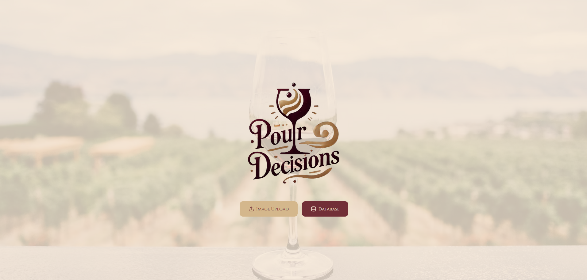
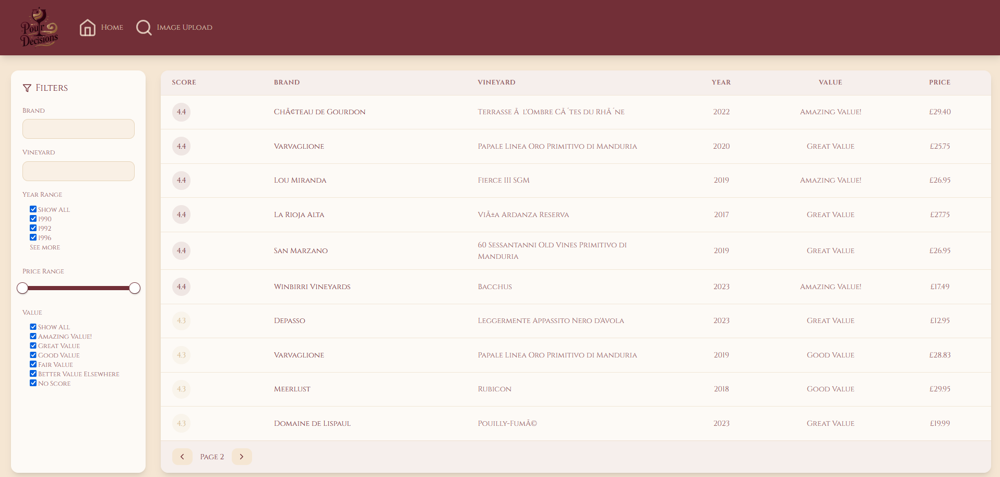
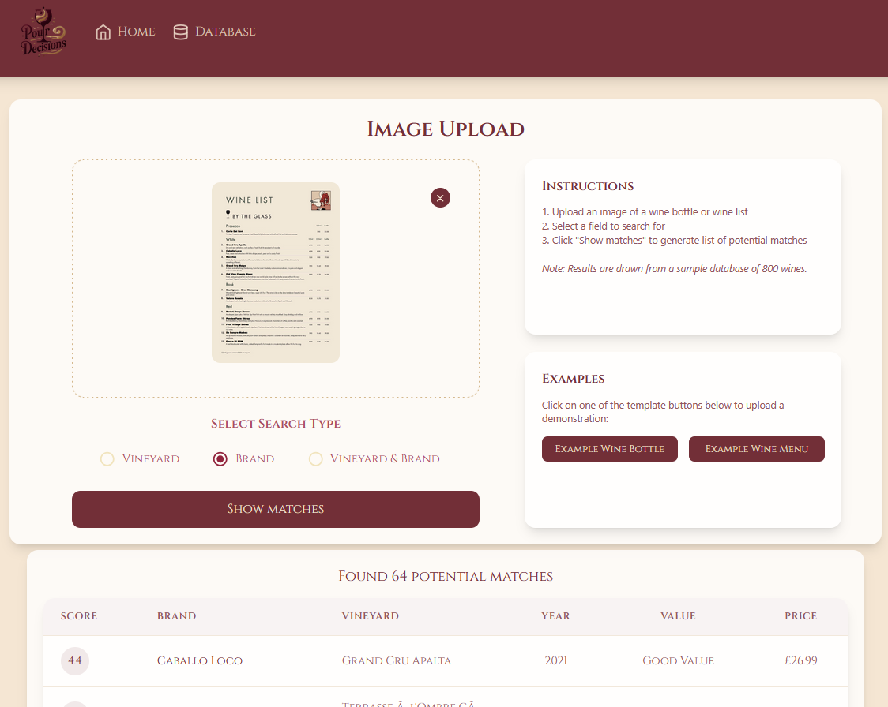

# 🍷 Pour Decisions

A wine image recognition application that helps users identify wines from images of bottles or wine lists. Simply upload an image and let AI-powered image recognition find matching wines from our database. Perfect for wine enthusiasts, restaurants, and anyone curious about discovering new wines.

## ✨ Features

- Image recognition for wine bottles and wine lists
- Search for wines by name, producer, type, or region
- View detailed information about matched wines
- Simple and intuitive user interface
- Pre-loaded examples to demonstrate functionality

## 📸 Screenshots

### Homepage:



### Database:



### AI-powered Image Recognition:



## 🔍 Demo

Live demo: [http://51.21.196.109:5173/](http://51.21.196.109:5173/)

**Note:** This is an HTTP page (not HTTPS), some browsers may block access. Please allow for this, and expect a slight load time.

## 🚀 Deployment

The application is deployed on an AWS EC2 instance. This deployment choice offers:

- Full control over the server environment
- Customizable security and permission settings
- Cost-effective hosting for demonstration purposes
- Ability to scale resources as needed

**Note:** This is an HTTP page (not HTTPS), some browsers may block access. Please allow for this, and expect a slight load time.

## 🐳 Docker

To allow for potential separate front end and back end deployment, I containerised my application in two Docker images that can be pulled and run using the following commands:

### Frontend Container

```
docker pull ghcr.io/samannetts8/pour_decisions_frontend:latest
docker run -p 5173:5173 samannetts8/pour-decisions-frontend:latest
```

### Backend Container

```
docker pull ghcr.io/samannetts8/pour_decisions_backend:latest
docker run -p 5000:5000 samannetts8/pour-decisions-backend:latest
```

## 🔧 Installation

### Prerequisites

- Node.js (v14 or higher)
- Python (v3.8 or higher)
- npm or yarn
- pip

### Virtual Environment

```bash
# Activate virtual environment
.\vivino_env\Scripts\activate
```

### Frontend Setup

```bash
# Clone the repository
git clone https://github.com/samannetts8/Pour_Decisions.git

# Install dependencies
npm install

# Start the development server
npm run dev
```

### Backend Setup

```bash
# Navigate to the backend directory
cd vivino_flask

# Install required packages
pip install -r requirements.txt

# Start the Flask server
python server.py
```

## 📦 Dependencies

### Frontend (package.json)

```json
{
  "dependencies": {
    "@chakra-ui/react": "^3.8.1",
    "@coreui/coreui": "^5.2.0",
    "@coreui/icons": "^3.0.1",
    "@coreui/react": "^5.5.0",
    "@emotion/react": "^11.14.0",
    "@emotion/styled": "^11.14.0",
    "@mui/material": "^6.4.5",
    "bootstrap": "^5.3.3",
    "esbuild": "^0.25.0",
    "framer-motion": "^11.18.2",
    "lucide-react": "^0.344.0",
    "react": "^18.3.1",
    "react-dom": "^18.3.1",
    "react-router-dom": "^7.1.5"
  },
  "devDependencies": {
    "@eslint/js": "^9.9.1",
    "@types/react": "^18.3.18",
    "@types/react-dom": "^18.3.0",
    "@vitejs/plugin-react": "^1.3.2",
    "autoprefixer": "^10.4.18",
    "concurrently": "^9.1.2",
    "eslint": "^9.9.1",
    "eslint-plugin-react-hooks": "^5.1.0-rc.0",
    "eslint-plugin-react-refresh": "^0.4.11",
    "globals": "^15.9.0",
    "postcss": "^8.4.35",
    "tailwindcss": "^3.4.1",
    "typescript": "^5.5.3",
    "typescript-eslint": "^8.3.0",
    "vite": "^6.1.0"
  }
}
```

### Backend (requirements.txt)

```
Flask
flask-cors
python-dotenv
supabase
pytesseract
pillow
opencv-python
numpy
```

## 🧑‍💻 Development Journey

Pour Decisions began as an project idea that I had long before I started my journey into programming and my eventual career change. Waiting for a friend at a restaurant, I wanted the ability to choose the best critically reviewed wines simply by scanning the list in front of me. However, most wine-focused apps at the time either didn't offer this, or hid the functionality behind a paywall. As such, I wanted to create my own version that gave me this ability, whilst simulataneously challenging myself to onboard many new skills, technologies and languages. The development process included:

1. **Research Phase**: Investigating OCR technologies and image recognition algorithms best suited for recognizing wine labels and menu text

2. **Data Collection**: Using HTML-scraping technologies to build a sample database of 800 wines with comprehensive information.

3. **Backend Development**: Creating a Flask API with endpoints for image processing and wine matching

4. **Frontend Design**: Designing a user-friendly React interface with Tailwind CSS for styling

5. **Integration**: Connecting the frontend and backend services

6. **Deployment**: Setting up Docker containers and deploying to AWS EC2

The project continues to evolve, with plans to expand the wine database and improve recognition accuracy.

## 👤 Authors

- [@samannetts8](https://github.com/samannetts8)

## 🚀 About Me

I am an aspiring full-stack developer with half a decade of experience in finance. After being headhunted to join a 5-man team managing >$10bn, I discovered my passion for programming while automating analysis suites and collaborating with quantitative traders on algorithmic trading scripts. My work ethic can be seen in my attainment of the CFA® chartership and co-founding a 400+ member corporate diversity and inclusion network, all whilst coordinating >$1bn mandate pitches. Through the School of Code, I have now developed expertise in full-stack development using React, JavaScript, Python, Flask, and SQL, alongside industry best practices like TDD, Agile methodologies, and hosting on AWS.

## 🔗 Links

[](https://github.com/samannetts8)
[](https://www.linkedin.com/in/sam-annetts-cfa-a9743b163/)

## 📄 License

This project is licensed under the MIT License - see the [LICENSE](LICENSE) file for details.
